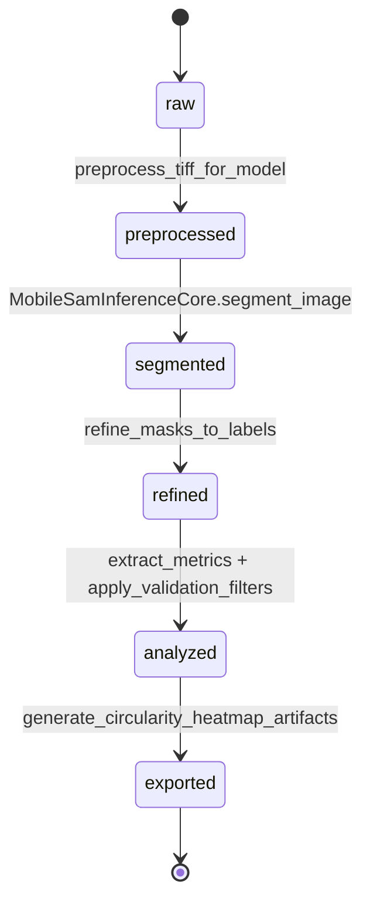

# Technical Architecture Guide — NMC811 Segmentation Runtime

## Scope and parity baseline

This document covers the implemented developer architecture for:

- Runtime orchestration (`src/main.py`, `src/pipeline/orchestrator_engine.py`)
- Preprocessing, segmentation, postprocessing, metrics, validation, visualization, export modules under `src/`
- PRD error contracts (`docs/PRD.yaml`) and their enforcement tests (`tests/`)
- Validation evidence in `docs/plan/nmc811_segmentation_1743108150/evidence/execute-validation-testing_final`

All module contracts and flows below are derived from current source behavior.

---

## 1) Module boundaries and responsibilities

| Module | Owns | Inputs | Outputs | Must not own |
|---|---|---|---|---|
| `src/main.py` | CLI parsing, runtime event logging, per-image loop policy (`continue-on-error` vs `fail-fast`) | CLI args and filesystem paths | JSON summary to stdout + JSONL runtime log | Image processing internals |
| `src/pipeline/orchestrator_engine.py` | Stage chaining and per-image state tracking | `input_dir`, `output_dir`, `config` + injected dependencies | Batch summary, merged CSV path, heatmap manifest path | CLI concerns, argument parsing |
| `src/preprocessing/pipeline.py` | TIFF ingest and CLAHE preprocessing | TIFF path, CLAHE params | uint8 model-ready image | Segmentation, metrics, exports |
| `src/segmentation/mobilesam_inference.py` | Model loading, mask generation/refinement, VRAM telemetry/cleanup | uint8 image + model configs | normalized mask payloads + telemetry | validation rules, CSV output |
| `src/postprocessing/morphology_ops.py` | Morphological opening, edge clearing, connected-component relabeling | list of masks | int32 label map | metric formulas, error catalog |
| `src/metrics/geometry_extractor.py` | Geometric metrics extraction and circularity safeguard annotation | int32 label map | metrics DataFrame (`METRICS_SCHEMA_COLUMNS`) | I/O, segmentation calls |
| `src/validation/filters.py` | Acceptance/rejection filtering and rejection stats | metrics DataFrame + `ValidationConfig` | annotated/valid DataFrames + stats | rendering/export |
| `src/visualization/heatmaps.py` | Circularity overlays, legends, metadata, manifest writing | image + annotated particles | PNG artifacts + per-image meta JSON + batch manifest JSON | filtering policy |
| `src/export/csv_export.py` | Cross-image metric consolidation and canonical CSV serialization | iterable of `(image_id, DataFrame)` | `analisis_gold_standard.csv` | image rendering |
| `src/utils/error_codes.py` | PRD error catalog + typed exception payload contract | error code + context | `PrdError` / serialized error payload | stage business logic |

---

## 2) State-machine flow (implemented)

Canonical state chain (PRD-aligned and implemented in orchestrator):

`raw -> preprocessed -> segmented -> refined -> analyzed -> exported`



Failure semantics:

- `orchestrator_engine.run_batch` captures exceptions per image and serializes them with `serialize_error`.
- Failed images keep the last reached state and expose partial `state_transitions`.
- Batch returns:
  - `completed` when no image fails
  - `completed_with_errors` when one or more images fail

This behavior is asserted in `tests/test_orchestrator_engine.py` and `tests/test_main_cli.py`.

---

## 3) Runtime composition and extension points

The primary extension mechanism is dependency injection through `config["dependencies"]` in `run_batch(...)`.

Injectable keys (all optional except `segmentation_core`):

- `preprocess_tiff_for_model`
- `segmentation_core` (**required**)
- `refine_masks_to_labels`
- `extract_metrics`
- `apply_validation_filters`
- `generate_circularity_heatmap_artifacts`
- `write_heatmap_batch_manifest`
- `consolidate_filtered_metrics_batch`
- `write_analisis_gold_standard_csv`

Practical extension use-cases:

1. Swap segmentation backend behavior by passing an alternative `segmentation_core`.
2. Add custom filtering policy by injecting `apply_validation_filters`.
3. Change export strategy by replacing consolidation/writer functions.
4. Add deterministic test doubles (as done in orchestrator/CLI tests) without changing production modules.

---

## 4) PRD error contract traceability map

Required mapping format: **code -> emitting module -> asserting test -> validation scenario**.

| Code | Emitting module | Asserting test(s) | Validation scenario |
|---|---|---|---|
| `ERR_IO_003` | `src/preprocessing/pipeline.py::load_tiff_uint16` via `raise_prd_error("ERR_IO_003", stage="ingestion", context={"path": ...})` | `tests/test_error_contracts_cross_module.py::test_err_io_003_emits_exact_prd_message_from_preprocessing_path` and `tests/test_preprocessing_pipeline.py::test_load_tiff_uint16_raises_err_io_003_for_corrupt_file` | Corrupt/unreadable TIFF fixture triggers exact PRD code/message with ingestion stage and file path context |
| `ERR_VRAM_001` | `src/segmentation/mobilesam_inference.py::segment_image` on OOM/stress threshold paths | `tests/test_error_contracts_cross_module.py::test_err_vram_001_emits_exact_prd_message_from_segmentation_oom_path` and `tests/test_mobilesam_inference.py::test_segment_image_oom_raises_err_vram_001_exact_message` / `...stress_threshold_raises_err_vram_001` | Forced CUDA OOM or VRAM stress-limit breach emits exact PRD error |
| `ERR_MASK_002` | `src/validation/filters.py::apply_validation_filters` when metrics are empty or valid set becomes empty | `tests/test_error_contracts_cross_module.py::test_err_mask_002_emits_exact_prd_message_from_zero_valid_filter_path` and `tests/test_validation_filters.py` | Zero-valid particle outcome after filters returns rejection stats and emits exact PRD code/message |
| `ERR_METRIC_004` | `src/metrics/geometry_extractor.py::extract_metrics` annotates row-level metric error (`metric_error_code`, `metric_error_message`) when perimeter is zero | `tests/test_error_contracts_cross_module.py::test_err_metric_004_emits_exact_prd_message_from_zero_perimeter_metrics_path` and `tests/test_geometric_metrics.py::test_extract_metrics_handles_zero_perimeter_with_prd_error_annotation` | Zero-perimeter contour case preserves pipeline continuity while flagging metric-level contract error |

---

## 5) Validation and evidence flow

Primary evidence root:

- `docs/plan/nmc811_segmentation_1743108150/evidence/execute-validation-testing_final`

Operational evidence artifacts:

- `full_pipeline/perf_metrics.json` (runtime, VRAM peak)
- `full_pipeline/runtime_execution.jsonl` (structured events)
- `error_contract_tests/pytest_output.txt`, `pytest_junit.xml`, `exit_code.txt`
- `acceptance_matrix_status.json`
- `detection_rate_reference_provisional.json`

Acceptance note (must remain explicit):

> Detection-rate acceptance (`>90%`) is **provisional pending manual counts** for `img_RDBS_0050` and `img_RDBS_0485`. Current acceptance matrix state is `pending_manual_validation` for that criterion.

---

## 6) Quality gate commands (with explicit conda path fallback)

Use either activated env commands or explicit `conda.exe run` fallback.

### Gate A — full test suite

Primary:

```powershell
conda run -n nmc811-segmentation pytest tests -q
```

Fallback:

```powershell
C:\Users\adria\miniconda3\Scripts\conda.exe run -n nmc811-segmentation pytest tests -q
```

### Gate B — PRD error contract suite

Primary:

```powershell
conda run -n nmc811-segmentation pytest tests/test_error_contracts_cross_module.py -q --junitxml docs\plan\nmc811_segmentation_1743108150\evidence\execute-validation-testing_final\error_contract_tests\pytest_junit.xml
```

Fallback:

```powershell
C:\Users\adria\miniconda3\Scripts\conda.exe run -n nmc811-segmentation pytest tests/test_error_contracts_cross_module.py -q --junitxml docs\plan\nmc811_segmentation_1743108150\evidence\execute-validation-testing_final\error_contract_tests\pytest_junit.xml
```

### Gate C — runtime pipeline replay

Primary:

```powershell
conda run -n nmc811-segmentation python -m src.main --input-dir gold_standard --output-dir docs\plan\nmc811_segmentation_1743108150\evidence\execute-validation-testing_final\full_pipeline --checkpoint-path weights/mobile_sam.pt --device cuda:0 --no-progress --log-file docs\plan\nmc811_segmentation_1743108150\evidence\execute-validation-testing_final\full_pipeline\runtime_execution.jsonl
```

Fallback:

```powershell
C:\Users\adria\miniconda3\Scripts\conda.exe run -n nmc811-segmentation python -m src.main --input-dir gold_standard --output-dir docs\plan\nmc811_segmentation_1743108150\evidence\execute-validation-testing_final\full_pipeline --checkpoint-path weights/mobile_sam.pt --device cuda:0 --no-progress --log-file docs\plan\nmc811_segmentation_1743108150\evidence\execute-validation-testing_final\full_pipeline\runtime_execution.jsonl
```

### Gate D — acceptance matrix verification

```powershell
Get-Content docs\plan\nmc811_segmentation_1743108150\evidence\execute-validation-testing_final\acceptance_matrix_status.json
Get-Content docs\plan\nmc811_segmentation_1743108150\evidence\execute-validation-testing_final\detection_rate_reference_provisional.json
```

