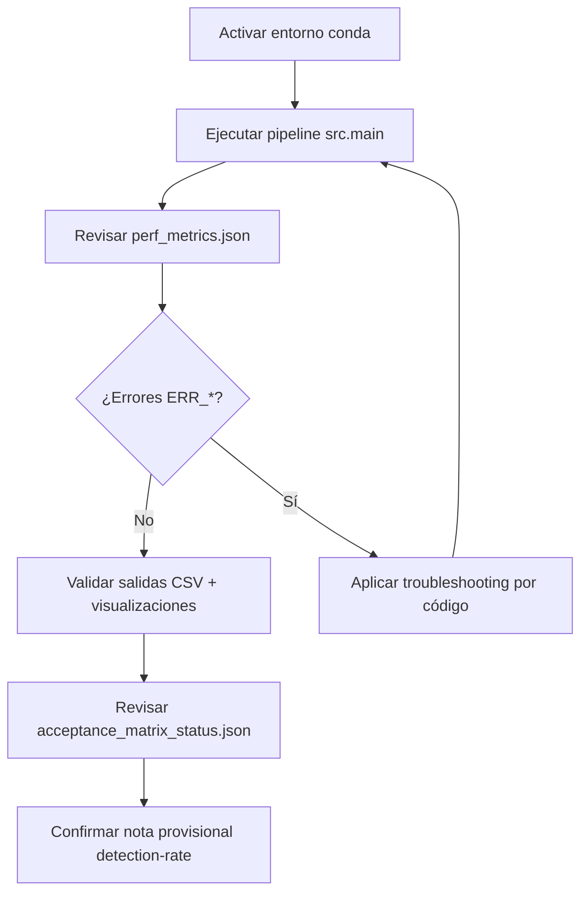

# Referencia Rápida Operativa — NMC811

## Flujo operativo (resumen)



## Comandos mínimos

### 1) Activar entorno

```powershell
conda activate nmc811-segmentation
```

### 2) Ejecutar pipeline completo

```powershell
C:\Users\adria\miniconda3\Scripts\conda.exe run -n nmc811-segmentation python -m src.main --input-dir gold_standard --output-dir docs\plan\nmc811_segmentation_1743108150\evidence\execute-validation-testing_final\full_pipeline --checkpoint-path weights/mobile_sam.pt --device cuda:0 --no-progress --log-file docs\plan\nmc811_segmentation_1743108150\evidence\execute-validation-testing_final\full_pipeline\runtime_execution.jsonl
```

### 3) Verificar contratos de error

```powershell
C:\Users\adria\miniconda3\Scripts\conda.exe run -n nmc811-segmentation pytest tests/test_error_contracts_cross_module.py -q --junitxml docs\plan\nmc811_segmentation_1743108150\evidence\execute-validation-testing_final\error_contract_tests\pytest_junit.xml
```

## Mapa de errores PRD

| Código | Mensaje canónico | Acción inmediata |
|---|---|---|
| `ERR_VRAM_001` | GPU memory exceeded during segmentation. Reduce image resolution or tile size. | Revisar `nvidia-smi`, correr por ventana (`--max-images`), inspeccionar `vram_samples.csv`. |
| `ERR_MASK_002` | No valid particles detected after filtering. Check thresholds or image quality. | Validar calidad TIFF, revisar parámetros de filtrado, reprocesar imagen aislada. |
| `ERR_IO_003` | Failed to read 16-bit TIFF file. Verify file integrity and tifffile library version. | Comprobar integridad TIFF y versión `tifffile`; recrear entorno si aplica. |
| `ERR_METRIC_004` | Circularity calculation failed: perimeter is zero. Check contour extraction. | Revisar máscaras refinadas y contornos de la imagen afectada. |

## Evidencia final que debe existir

- `docs/plan/nmc811_segmentation_1743108150/evidence/execute-validation-testing_final/full_pipeline/perf_metrics.json`
- `docs/plan/nmc811_segmentation_1743108150/evidence/execute-validation-testing_final/full_pipeline/runtime_execution.jsonl`
- `docs/plan/nmc811_segmentation_1743108150/evidence/execute-validation-testing_final/full_pipeline/stdout.json`
- `docs/plan/nmc811_segmentation_1743108150/evidence/execute-validation-testing_final/full_pipeline/stderr.txt`
- `docs/plan/nmc811_segmentation_1743108150/evidence/execute-validation-testing_final/error_contract_tests/pytest_output.txt`
- `docs/plan/nmc811_segmentation_1743108150/evidence/execute-validation-testing_final/error_contract_tests/pytest_junit.xml`
- `docs/plan/nmc811_segmentation_1743108150/evidence/execute-validation-testing_final/acceptance_matrix_status.json`
- `docs/plan/nmc811_segmentation_1743108150/evidence/execute-validation-testing_final/detection_rate_reference_provisional.json`

## Estado de aceptación de detection-rate

La aceptación de **detection-rate >90%** es **provisional** hasta registrar conteos manuales de referencia en `img_RDBS_0050` e `img_RDBS_0485`. Mientras tanto, la matriz de aceptación mantiene estado `pending_manual_validation` para ese criterio.
